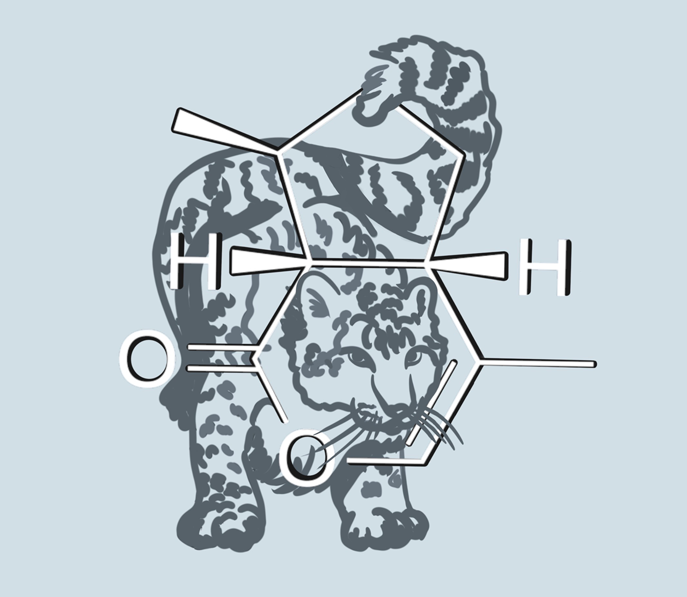

# BARSIC -- Basic All-purpose RDKit-based SQL Instant Chemistry for Snowflake


DDL SQL code to create a set of user-defined functions in [Snowflake](https://www.snowflake.com/en/) to enable chemical structure queries (exact structure, substructure, superstructure, similarity), chemistry data file import and export, structure manipulations and standardizations, and molecular property computations based on [RDKit](https://www.rdkit.org/), an open-source toolkit for cheminformatics.

## Installation and usage

The sql folder contains the core DDL and examples. To create definitions of the core functions in your Snowflake database of choice:
1. Log in to a Snowflake database where you would like the functions to be defined. The login must be mapped to a Snowflake role that allows the creation of schemas, user-defined functions, procedures and tables.
2. Create a new Snowflake workbook and paste the entire contents of `sql/ChemCoreApi.sql` into it. Make sure the session's database is set to the one in which you want the functions to be defined, and choose a warehouse to execute the SQL statements in the workbook. You may need to edit the `USE <database_name_here>` line to specify the target database where you want the chem_api schema and all UDF's to be created.
3. Run the entire workbook.
4. Create a second workbook and paste into it the entire contents of `sql/Examples.sql`. Carefully study the examples and make sure you fully understand how the code works. Run the examples one by one.
5. Follow the examples of tables and procedures from `sql/Examples.sql` to define your own tables with chemical structures, as well as views and stored procedures that simplify the use of the core chemical functions. It is recommended that the `chem_api` schema be used only for the core function definitions and examples, and all other tables, functions, procedures and views using the core chemistry functions be defined in separate schemas.

## Development workflow (inline Python/Java decoupled from SQL)

The inline Python/Java code for each Snowflake Python/Java UDF is provided in separate Python/Java modules to simplify the code development and testing. Use `tools/sql_udf_builder.py` as described below to assemble the SQL.

Structure:
- `templates/ChemCoreApi.sql.tpl` – template SQL; each UDF Python block is replaced by an include directive.
- `python/*.py` – per-UDF Python source files extracted from the monolithic SQL. Each file starts with a comment that highlights the exposed Python handler function used by the corresponding SQL UDF.
- `tools/sql_udf_builder.py` – compiler that assembles the final SQL by injecting the Python sources back into the template.

Include directive format used inside the template (between the `$$` markers of a UDF):

```
-- @include python/<FunctionName>.py
```

### Compile the final SQL
From the project root, run:

```
python3 tools/sql_udf_builder.py \
  --template templates/ChemCoreApi.sql.tpl \
  --output sql/ChemCoreApi.sql
```

This generates `sql/ChemCoreApi.sql` by injecting the `python/*.py` and `java/*.java`sources into the template.

Note: all source code changes must be made in `templates/ChemCoreApi.sql.tpl` and/or source code files under java or python directories, but every time these changes are finalized and are ready for a release, `tools/sql_udf_builder.py` must be run to produce a version of ChemCoreApi.sql that incorporates the latest changes and is ready for deployment.

## Acknowledgments

Ramil Nugmanov (https://github.com/stsouko) for pre-release code reviews. Ramil also proposed splitting the large, hard-to-maintain SQL file containing definitions for all user-defined functions with inline Python or Java code provided by BARSIC into a “master” SQL template and separate Python and Java modules. A separate command-line utility then assembles these pieces into deployable SQL, which significantly simplified development, debugging, and testing of the inline code.

Ksenia Alexandrova (https://github.com/KseniaA3) for creating the BARSIC logo.
